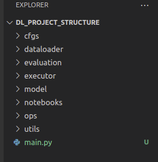

# Best practices to write Deep Learning code: ```Project structure```, ```OOP```, ```Type checking``` and ```documentation```

※ refer to [AI SUMMER](https://theaisummer.com/best-practices-deep-learning-code/)


### Topics 

How to write ```organized```, ```modularized```, and ```extensible``` python code.


## Project Structure ([ref](https://github.com/The-AI-Summer/Deep-Learning-In-Production/tree/master/2.%20Writing%20Deep%20Learning%20code:%20Best%20Practises))



A good structure should obey the **“Separation of concerns” principle** in terms that **each functionality should be a distinct component**. In this way, it can be easily modified and extended without breaking other parts of the code. Moreover, it can also be reused in many places without the need to write duplicate code.


### Python modules and packages 

```Each folder``` is a ```separate module``` that can be imported in other modules just by doing “```import module```”. A ```module``` is simply a __file__ containing Python code. A ```package```, however, is like a __directory__ that holds sub-packages and modules.


In our example, we have 8 different packages:

1. __cfgs__ : in ```configs``` we define every single thing that can be configurable and can be changed in the future. Good examples are training ```hyperparameters```, ```folder paths```, the ```model architecture```, ```metrics```, ```flags```.

2. __dataloader__ : all the ```data loading``` and ```data preprocessing``` classes and functions live here.
3. __evaluation__ : a collection of code that aims ```to evaluate``` the ```performance``` and ```accuracy``` of our model.
4. __executor__ : all the functions and scripts that ```train``` the ```model``` or use it to ```predict``` ```something``` in different environments; (__executors for GPUs__, __executors for distributed systems__). This package is our connection with the outer world and it’s what our “```main.py```” will use.
5. __model__ : it contains the actual deep learning code. 
6. __notebooks__ : it includes all of our ```jupyter/colab``` notebooks in one place.
7. __ops__ : this one is ```not always needed```, as it includes operations not related with machine learning such as ```algebraic transformations```, ```image manipulation techniques``` or maybe ```graph operations```.
8. __utils__ : ```utilities functions``` that are used in more than one places and everything that don’t fall in on the above come here.


## Object-oriented programming(OOP) in Python


``` python
class BaseModel(nn.Module):
    """Abstract Model class that is inherited to all models"""
    def __init__(self, cfg):
        self.config = Config.from_yaml(cfg)

    @abstractmethod
    def load_data(self):
        pass

    @abstractmethod
    def build(self):
        pass

    @abstractmethod
    def train(self):
        pass

    @abstractmethod
    def evaluate(self):
        pass    
```

