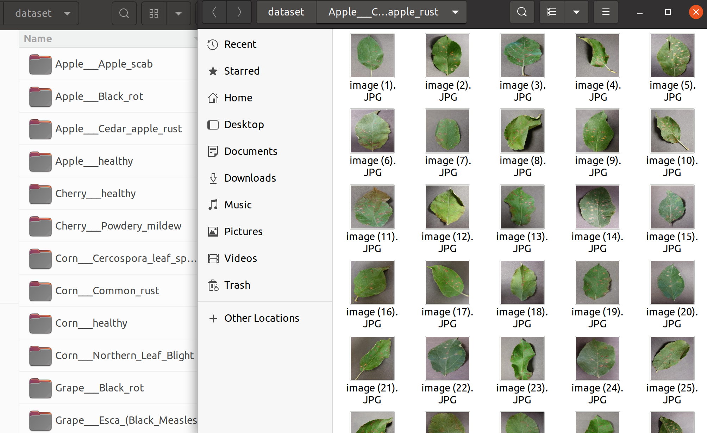
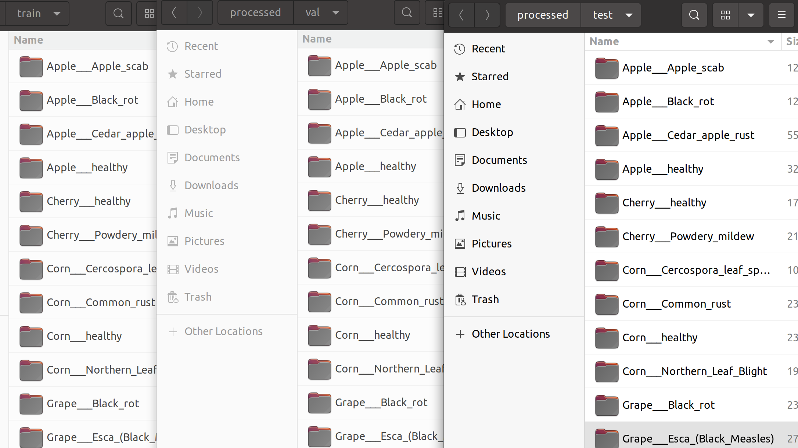
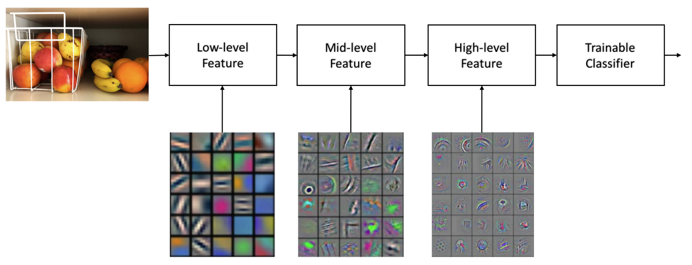
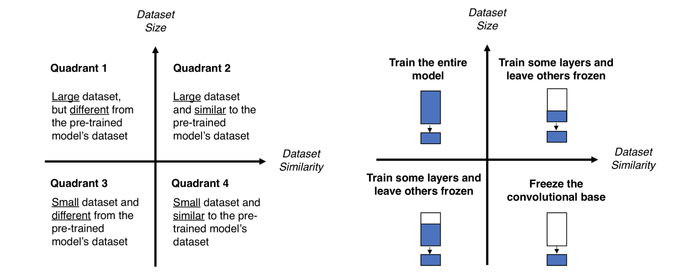

# 작물 잎 사진으로 질병 분류하기 

## Contents 

* [데이터 준비](#데이터 준비 )
* [데이터 구조](#데이터 구조)
* [실험 설계를 위한 데이터 분할](#실험 설계를 위한 데이터 분할)
* [데이터셋 및 데이터 로더(dataloader) 생성](#데이터셋 및 데이터 로더(dataloader) 생성)
* [베이스라인 모델 설계](#베이스라인 모델 설계)
* [전이 학습 (Transfer Learning)](#전이 학습 (Transfer Learning))


## 데이터 준비 

데이터 출처: [bjpublic's github](https://github.com/bjpublic/DeepLearningProject/tree/main/04_%EC%9E%91%EB%AC%BC_%EC%9E%8E_%EC%82%AC%EC%A7%84_%EC%A7%88%EB%B3%91_%EB%B6%84%EB%A5%98)

* 위의 링크로 이동하여 ```dataset.zip``` 파일을 다운 받고 압축을 해제합니다. 

```yaml
# 프로젝트 구조 
/
├ dataset     # raw dataset 
├ processsed  # 전치리로 분할된 dataset 
└ Plant-Leaf-Classification.ipynb  # 프로젝트 코드 
```


## 데이터 구조 

각 이미지의 분류 클래스가 각각 디렉토리로 구분되어 있는 형태. 

* Train, Validation, Test 데이터가 따로 구별되어 있지 않음. 
* 클래스 레이블은 디렉토리 이름으로 대체 

 

```yaml
dataset
├ Apple___Apple_scab 
│	├ image (1).JPG
│	├ ...
│	└ image (630).JPG
... 
└ Tomato___Tomato_Yellow_Leaf_Curl_Virus
	├ image (1).JPG
	├ ...
	└ image (5357).JPG
```


## 실험 설계를 위한 데이터 분할 

위의 raw dataset 을 학습을 위해 Train, Validation, Test dataset으로 분할하는 전처리 진행. 

* train, val, test 디렉토리를 생성 
* 각 디렉토리 하위로 클래스의 목록에 해당하는 디렉토리를 추가로 생성
* 마지막으로 ```dataset``` 으로 부터 이미지 데이터를 복사해옴 (train:val:test = 6:2:2)

 

```yaml
processed 
├ train
│	├ Apple___Apple_scab 
│	├ ... 
│	└ Tomato___Tomato_Yellow_Leaf_Curl_Virus
├ val 
│	├ Apple___Apple_scab 
│	├ ... 
│	└ Tomato___Tomato_Yellow_Leaf_Curl_Virus
└ test 
	├ Apple___Apple_scab 
	├ ... 
	└ Tomato___Tomato_Yellow_Leaf_Curl_Virus
```


## 데이터셋 및 데이터 로더(dataloader) 생성 

필요한 개념과 기능: 

* ```torchvisiondatasets.ImageFolder```  메소드 
  * 스토리지(storage)상의 데이터셋을 PyTorch 환경으로 불러오는 메소드
  * 여기서 사용되는 dataset은 ```하나의 클래스가 하나의 디렉토리에 대응 됨```. 
    * 이러한 구조의 데이터셋을 로드할 때는 ```ImageFolder``` 메소드를 사용하면 간단함
    * (왜?) 디렉토리별 label encoding 을 해당 메소드가 내부적으로 해주기 때문

* ```torch.utils.data.DataLoader``` 

  * PyTorch 환경으로 불러온 dataset을 주어진 조건에 따라 미니 배치 단위로 분리하는 역할 수행 

  

## 베이스라인 모델 설계 

필요한 개념과 기능: 

* ```nn.Module``` ; 딥러닝 모델과 관련된 기본적인 함수를 포함하는 클래스 
* ```super().__init__()``` ; 부모 클래스의 메소드를 상속받아 사용하기 위함 
* ```torch.no_grad()``` ; 해당  코드 블럭에서 실행되는 모델은 Parameter 업데이트를 중단함 (gradient value를 기록하지 않기 때문에 inference 속도가 더 빨라짐)


## 전이 학습 (Transfer Learning)


([source: Laptrnhx's post](https://laptrinhx.com/transfer-learning-with-deep-learning-machine-learning-techniques-1499149008))

전이 학습(transfer learning) 정의: 

*  (양질의 데이터셋을 대량으로 구하기 어려울 경우) 대량의 데이터셋으로 ```미리 학습된 모델(pre-trained model)```을 재활용 해, ```일부를 조정하여(fine-tuning)``` 다른 주제의 데이터셋에서도 높은 정확도를 끓어내기 위한 학습 방법.
* [torchvision.models](https://pytorch.org/vision/stable/models.html#classification) 패키지에서 양질의 방대한 benchmark에서 학습된 모델을 바로 불러올 수 있음. 


전이 학습의 장점: 

* 디자인된 모델이 빨리 수렴하기 위해서는 ```모델 파라미터(parameter) 초기값을 잘 설정하는 것```도 또한 중요하다. 
* Pre-trained model의 가중치를 활용하는 것은 ```파라미터 초기화 방법중 하나로 볼 수 있음```. 
* 더욱이 대량의 데이터로 미리 학습되어 얻어진 결과이기 때문에 처음부터 높은 퀄리티의 특징을 학습할 수 있음 


Fine-tuning:

* Pre-trained model의 파라미터 값 일부를 ```내가 가진 데이터셋의 특성에 맞게 다시 학습```하여 ```파라미터를 세부적으로 조정```하는 행위 
* 이때, 사용할 Pre-trained model의 일부 Layer는 학습이 되지 않도록 ```requires_grad=False``` 로 설정하여 파라미터가 업데이트 되지 않도록 고정시킴; 이를 ```'Layer를 Freeze 한다'``` 고 표현함.


Transfer Learning이 가능한 이유: 

 

(feature-level 시각화: [source](https://www.packtpub.com/product/deep-learning-essentials/9781785880360))


* Neural Networks 가 학습되는 과정을 살펴보면 초기 Layer에서 낮은 수준의 특징(Low-level features)을 먼저 학습한다. (e.g.) 모서리(edge)와 같은 작은 지역 패턴(local pattern).
* 이를 토대로 점진적으로 높은 수준의 특징(High-level features)를 학습한다. (i.e.) Low-level feature로 구성된 더 큰 패턴.
* 다른 종류의 이미지라도 ```Low-level features는 상대적으로 비슷할 가능성이 높다```. 이 때문에 Fine-tuning 과정은 마지막 Layer인 분류기(Classifier)와 가까운 Layer에서 부터 원하는 만큼 학습 과정에서 업데이트를 진행한다. 
  * 이때, Freeze 하는 Layer의 수는 주어진 데이터셋의 크기와 Pre-trained model에 사용된 데이터셋과의 유사성을 고려하여 결정한다. 


 

[데이터크기-유사성 그래프 & 각 상황에 따른 Fine-tuning 전략 (source)](https://jeinalog.tistory.com/13)


어느 상황에서 얼마나 많은 Layer를 Freeze해야 할지 결정하는 방법: 

* ```우리가 가진 데이터셋의 크기```와 ```Pre-trained model의 학습에 사용된 데이터셋```과의 유사도를 먼저 비교한다. 이는 크게 4가지로 구분된다. 
* 데이터셋의 유사도에 따라 마찬가지 Freeze할 Layer의 범위를 정할 수 있다. 
* ([여기 참고](https://jeinalog.tistory.com/13))
